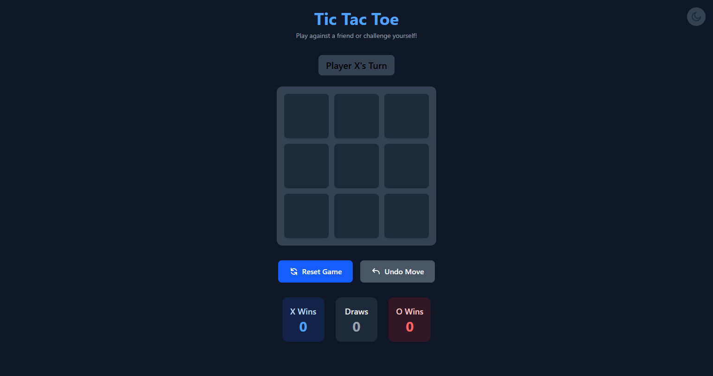

# Tic Tac Toe

A modern, responsive Tic Tac Toe game built with HTML, Tailwind CSS, and JavaScript. Which is made only in one file.

## Features

- **Interactive Gameplay:** Play as X or O against another player on the same device.
- **Undo Move:** Undo your last move at any time.
- **Score Tracking:** Tracks wins for X, O, and draws.
- **Reset Game:** Start a new game with the click of a button.
- **Dark Mode:** Toggle between light and dark themes. Theme preference is saved.
- **Responsive Design:** Looks great on desktop and mobile devices.
- **Animated Effects:** Winning cells are highlighted with a pulse animation.

## How to Use

1. **Open `https://1flietictactoe.netlify.app/` in your browser.**
2. Click on any cell to make your move.
3. Use the **Reset Game** button to start over.
4. Use the **Undo Move** button to revert the last move.
5. Toggle dark mode using the button in the top-right corner.

## Technologies Used

- **HTML5**
- **Tailwind CSS** (via CDN)
- **Vanilla JavaScript**

## File Structure

- `TicTacToe.html` — Main game file with all logic and styles.
- `README.md` — This documentation.

## Customization

You can easily modify the styles or add new features by editing the HTML and JavaScript in `TicTacToe.html`.

---

Enjoy playing!

